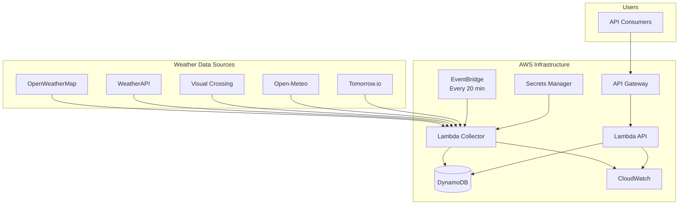

# BCE - Weather API Aggregation System

A comprehensive serverless weather API that aggregates data from multiple free weather APIs, stores it in AWS DynamoDB, and serves it through a unified REST API endpoint. Built with AWS Lambda, API Gateway, and automated CI/CD using GitHub Actions.

## 🌟 Features

- **Multi-Source Data Aggregation**: Collects weather data from 5+ free weather APIs
- **Serverless Architecture**: Built on AWS Lambda for cost-effectiveness and scalability
- **Automated Data Collection**: Scheduled collection every 20 minutes via EventBridge
- **RESTful API**: Clean API endpoints for current and historical weather data
- **Data Quality Scoring**: Automatic quality assessment of aggregated data
- **Cost-Optimized**: Designed to run under $10/month for moderate usage
- **CI/CD Pipeline**: Automated deployment via GitHub Actions
- **Infrastructure as Code**: Complete CloudFormation template included
- **Local Development**: SAM CLI support for local testing

## 📋 Table of Contents

- [Architecture](#architecture)
- [Prerequisites](#prerequisites)
- [Quick Start](#quick-start)
- [API Documentation](#api-documentation)
- [Local Development](#local-development)
- [Deployment](#deployment)
- [Configuration](#configuration)
- [Monitoring](#monitoring)
- [Cost Analysis](#cost-analysis)
- [Contributing](#contributing)

## 🏗️ Architecture



### Components

- **Lambda Collector**: Fetches data from weather APIs and stores in DynamoDB
- **Lambda API**: Serves aggregated weather data through REST endpoints
- **DynamoDB**: NoSQL database for time-series weather data
- **API Gateway**: REST API exposure with rate limiting
- **EventBridge**: Scheduled triggers for data collection
- **Secrets Manager**: Secure storage of API keys
- **CloudWatch**: Logging, monitoring, and dashboards

## 📦 Prerequisites

### Required

- AWS Account with appropriate permissions
- Python 3.11 or Node.js 18.x
- AWS CLI configured
- Git

### API Keys (Free Tier)

Sign up for free API keys from:

1. [OpenWeatherMap](https://openweathermap.org/api) - 1,000 calls/day
2. [WeatherAPI](https://www.weatherapi.com/) - 1M calls/month
3. [Visual Crossing](https://www.visualcrossing.com/) - 1,000 records/day
4. [Tomorrow.io](https://www.tomorrow.io/) - 500 calls/day
5. [Open-Meteo](https://open-meteo.com/) - No API key required

## 🚀 Quick Start

### 1. Clone the Repository

```bash
git clone https://github.com/yourusername/weather-api-aggregator.git
cd weather-api-aggregator
```

### 2. Configure API Keys

Create `config/api-keys.json`:

```json
{
  "openweathermap": "YOUR_OPENWEATHERMAP_API_KEY",
  "weatherapi": "YOUR_WEATHERAPI_KEY",
  "visualcrossing": "YOUR_VISUALCROSSING_KEY",
  "tomorrow_io": "YOUR_TOMORROW_IO_KEY"
}
```

### 3. Deploy to AWS

```bash
# Make script executable
chmod +x scripts/deploy.sh

# Deploy to development environment
./scripts/deploy.sh dev

# Deploy to production
./scripts/deploy.sh prod
```

### 4. Verify Deployment

```bash
# Get the API endpoint from the deployment output
API_ENDPOINT="https://your-api-id.execute-api.us-east-1.amazonaws.com/prod"

# Test the health endpoint
curl $API_ENDPOINT/health

# Get current weather
curl $API_ENDPOINT/weather/current
```

## 📚 API Documentation

### Base URL

```
https://your-api-id.execute-api.us-east-1.amazonaws.com/prod
```

### Endpoints

#### GET /health

Health check endpoint

**Response:**
```json
{
  "status": "healthy",
  "timestamp": "2024-01-15T12:00:00Z",
  "location": "lewisville-tx",
  "database": {
    "status": "connected",
    "table": "weather-aggregator-prod-weather-data"
  },
  "data": {
    "last_update": "2024-01-15T11:50:00Z",
    "is_fresh": true
  },
  "version": "1.0.0"
}
```

#### GET /weather/current

Get current weather conditions

**Response:**
```json
{
  "location": "lewisville-tx",
  "timestamp": "2024-01-15T12:00:00Z",
  "data_quality_score": 0.85,
  "sources": ["openweathermap", "weatherapi", "openmeteo"],
  "current_conditions": {
    "temperature": {
      "value": 25.5,
      "min": 24.0,
      "max": 27.0,
      "unit": "celsius"
    },
    "humidity": {
      "value": 65,
      "min": 60,
      "max": 70,
      "unit": "percent"
    },
    "pressure": {
      "value": 1013,
      "unit": "hPa"
    },
    "wind": {
      "speed": {
        "value": 3.5,
        "unit": "m/s"
      },
      "direction": {
        "value": 180,
        "unit": "degrees"
      }
    },
    "weather": "Partly cloudy"
  }
}
```

#### GET /weather/history?hours=24

Get historical weather data

**Parameters:**
- `hours` (optional): Number of hours of history (default: 24, max: 168)

**Response:**
```json
{
  "location": "lewisville-tx",
  "period": {
    "start": "2024-01-14T12:00:00Z",
    "end": "2024-01-15T12:00:00Z",
    "hours": 24
  },
  "data_points": 72,
  "statistics": {
    "temperature": {
      "avg": 23.5,
      "min": 18.0,
      "max": 28.0
    }
  },
  "history": [
    {
      "timestamp": "2024-01-15T12:00:00Z",
      "temperature": 25.5,
      "humidity": 65,
      "weather": "Partly cloudy"
    }
  ]
}
```

#### GET /weather/sources

Get information about data sources

**Response:**
```json
{
  "location": "lewisville-tx",
  "coordinates": {
    "latitude": 33.0462,
    "longitude": -96.9942
  },
  "available_sources": [
    {
      "name": "OpenWeatherMap",
      "id": "openweathermap",
      "description": "Current weather, temperature, humidity, pressure, wind",
      "update_frequency": "Every 20 minutes",
      "free_tier_limit": "1000 calls/day"
    }
  ],
  "aggregation_method": "Average values from all available sources",
  "update_schedule": "Every 20 minutes",
  "data_retention": "30 days"
}
```

## 💻 Local Development

### Setup

```bash
# Install dependencies
pip install -r requirements.txt

# Set up local development environment
chmod +x scripts/local-dev.sh
./scripts/local-dev.sh setup
```

### Running Locally

```bash
# Start local API server
./scripts/local-dev.sh start

# In another terminal, test the endpoints
./scripts/local-dev.sh test

# Invoke weather collector manually
./scripts/local-dev.sh invoke
```

### Testing

```bash
# Run unit tests
pytest tests/unit/ -v

# Run integration tests
export API_ENDPOINT=http://localhost:3000
pytest tests/integration/ -v

# Run all tests with coverage
pytest tests/ -v --cov=src --cov-report=html
```

## 🚢 Deployment

### GitHub Actions CI/CD

The repository includes a complete CI/CD pipeline that:

1. Runs tests on every push
2. Validates CloudFormation templates
3. Builds and packages Lambda functions
4. Deploys to AWS automatically
5. Runs integration tests post-deployment

### Manual Deployment

```bash
# Deploy to specific environment
./scripts/deploy.sh [dev|staging|prod]

# Update only Lambda function code
aws lambda update-function-code \
  --function-name weather-aggregator-prod-collector \
  --s3-bucket your-deployment-bucket \
  --s3-key lambdas/weather-collector.zip
```

### GitHub Repository Setup

1. Fork/clone this repository
2. Set up GitHub Secrets:
   - `AWS_ACCESS_KEY_ID`
   - `AWS_SECRET_ACCESS_KEY`
   - `AWS_ACCOUNT_ID`
3. Update API keys in AWS Secrets Manager
4. Push to main branch to trigger deployment

## ⚙️ Configuration

### Environment Variables

| Variable | Description | Default |
|----------|-------------|---------|
| `DYNAMODB_TABLE_NAME` | DynamoDB table name | weather-data |
| `SECRET_MANAGER_ARN` | Secrets Manager ARN | - |
| `LOCATION` | Location identifier | lewisville-tx |
| `LATITUDE` | Location latitude | 33.0462 |
| `LONGITUDE` | Location longitude | -96.9942 |
| `CORS_ORIGIN` | CORS allowed origin | * |

### CloudFormation Parameters

| Parameter | Description | Default |
|-----------|-------------|---------|
| `Environment` | Deployment environment | prod |
| `ApiName` | API name | weather-aggregator |
| `DataRetentionDays` | Days to retain data | 30 |
| `Location` | Weather location | lewisville-tx |

## 📊 Monitoring

### CloudWatch Dashboard

Access the automatically created dashboard:

```
https://console.aws.amazon.com/cloudwatch/home?region=us-east-1#dashboards:name=weather-aggregator-prod-dashboard
```

### Metrics

- Lambda invocations and errors
- API Gateway requests and latency
- DynamoDB read/write capacity
- Data freshness monitoring

### Alarms

- Collector function errors
- API high error rate
- Data staleness (no updates for 30+ minutes)

## 💰 Cost Analysis

### Estimated Monthly Costs (Moderate Usage)

| Service | Usage | Cost |
|---------|-------|------|
| Lambda | 2,880 invocations @ 512MB | $0.50 |
| API Gateway | 10,000 requests | $0.04 |
| DynamoDB | On-demand, < 1GB storage | $1.50 |
| CloudWatch | Logs and metrics | $2.00 |
| Secrets Manager | 1 secret | $0.40 |
| **Total** | | **~$4.44/month** |

### Cost Optimization Tips

1. Use DynamoDB on-demand pricing for variable workloads
2. Set CloudWatch log retention to 7 days
3. Monitor Lambda memory allocation and optimize
4. Use caching to reduce API calls
5. Implement DynamoDB TTL for automatic cleanup

## 🤝 Contributing

1. Fork the repository
2. Create a feature branch (`git checkout -b feature/AmazingFeature`)
3. Commit your changes (`git commit -m 'Add some AmazingFeature'`)
4. Push to the branch (`git push origin feature/AmazingFeature`)
5. Open a Pull Request

## 📄 License

This project is licensed under the MIT License - see the [LICENSE](LICENSE) file for details.

## 🙏 Acknowledgments

- Weather data provided by free tier APIs
- Built with AWS serverless services
- Inspired by the need for consolidated weather data

## 📞 Support

For issues, questions, or suggestions:
- Open an issue on GitHub
- Check the [API Documentation](docs/API.md)
- Review the [Troubleshooting Guide](docs/TROUBLESHOOTING.md)

---

**Made with ❤️ by a sleepless developer.**